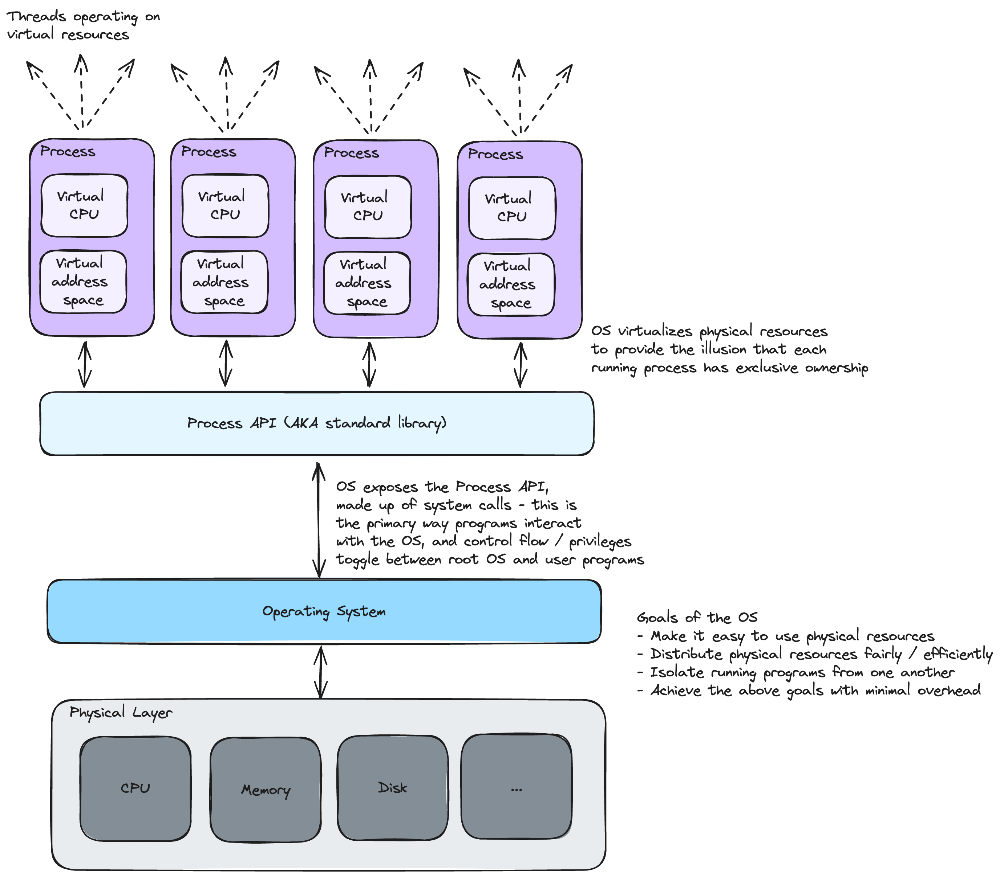

# Introduction to Operating Systems

## Key Questions
1. How does an the OS virtualize physical resources?
2. How does the OS run concurrent programs fairly (i.e. ensuring that each program gets its share of physical resources) and correctly (i.e. ensuring that one program does not interfere with another)?
3. How does the OS persist data efficiently and correctly?

## Key Terms / Concepts
- **Virtualization**: The transformation of a shared physical resource (CPU, memory, disk, etc.) into scoped virtual resources. Virtualization provides the illusion that each running program has exclusive ownership of all physical resources, which dramatically simplifies programs. The operating system manages the virtualization process so that each process (i.e. running program) has its own virtual CPU, memory address space, etc.
- **System call**: A function exposed by the operating system to other running programs. Operating systems tend to expose a few hundred system calls, which in totality make up the *standard library*. The standard library is the *API* for programs that need to interact with the operating system. A system call from a program transfers control to the OS, which in turn raises the *hardware privilege level* (e.g. from user mode to root / kernel mode) - once the call is complete, control is transferred back to the running program.
- **Trap**: A special hardware instruction that transfers control to the OS when a system call is initiated. The *trap handler* raises the privilege level which enables the OS to execute the system call, and the *return-from-trap* instruction reverts back to user mode.
- **Process**: Running program with its own private virtualized resources
- **Thread**: Function within a running program that can access the underlying process's private virtualized resources
- **Mechanism**: High-level functionality offered by the OS (e.g. the ability to run programs concurrently).
- **Policy**: Algorithm to decide on a course of action in response to the OS state (e.g. the algorithm to determine which concurrent program to run)

 
 
 

